# FestFlow — Event Management System

<div align="center">

[](https://flutter.dev)
[](https://firebase.google.com)
[](https://dart.dev)
[](LICENSE)

*The Streamlined Way to Manage College Fests & Events*

[View Presentation](docs/reports/README.md) · [Setup Guide](docs/SETUP.md) · [Report Vulnerability](SECURITY.md)

</div>

---

FestFlow is a feature-rich, role-based Event Management System designed to handle complex event registration, guest scanning, real-time feedback, and attendee management. Built using **Flutter** and backed by **Firebase**, FestFlow bridges the gap between event organizers (Leaders), staff (Members), and attendees (Guests). It features interactive analytics, offline status tracking, security controls, and a dedicated Web Admin Console.

---

## 🌟 Key Features

### 👤 Role-Based Access Control (RBAC)
- **Leaders (Hosts)**: Fully manage fests and sub-events, invite members via custom credentials, approve/reject guests, build custom forms, and generate AI-powered analytics.
- **Members (Staff)**: Scan QR codes for attendee entry, view event statistics, update event details, and manage check-in logs.
- **Guests (Attendees)**: Register for events, fill custom questionnaire forms, access event maps, receive announcements, and trigger SOS alerts.

### 📋 Custom Form Builder
- Google Forms-style dynamic question creator for event organizers.
- Supports text fields, multiple-choice options, and check-ins.
- Guest answers are captured in Firestore for screening.

### 📊 AI-Powered Analytics
- Integration with the **Google Gemini API** to generate automated event performance reports.
- Real-time statistics on attendee count, approval rate, checked-in guests, and engagement.

### 🔑 Secure QR Code Check-Ins
- Secure QR code generation for approved guests.
- Real-time camera scanner (`mobile_scanner`) for event members to validate tickets instantly.

### 📢 Real-Time Communications
- In-app global announcement board with instant updates.
- Real-time presence detection (Online/Offline) tracking for coordination.
- Live chat support between members and guests.

### 🛡️ Safety & SOS
- Instant Emergency SOS button for guests, allowing quick escalation to event organizers.

---

## 🛠️ Technology Stack

| Component | Technology | Version / Purpose |
| --- | --- | --- |
| **Mobile Core** | Flutter / Dart | `v3.6.2+` / Cross-platform app shell |
| **Backend** | Firebase Suite | Auth, Cloud Firestore, Cloud Storage |
| **AI Engine** | Google Generative AI | `gemini-2.0-flash` / Analytics reports |
| **Admin Web** | HTML / JS / Vanilla CSS | GSAP animations for global dashboard |
| **QR Scanner** | Mobile Scanner | Camera-based check-in integration |

---

## 📐 System Architecture

FestFlow's system design is modeled using standard software engineering principles. Below is the conceptual workflow:

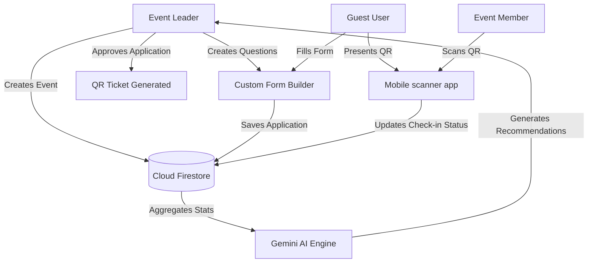

For comprehensive structural diagrams, see the [Architecture Docs](docs/architecture/):
- [Class Diagram](docs/architecture/class-diagram.png)
- [Sequence Diagram](docs/architecture/sequence-diagram.png)
- [Use Case Diagram](docs/architecture/use-case-diagram.png)
- [System Deployment Diagram](docs/architecture/system-architecture.png)

---

## 📸 Screenshots & Showcase

### 📱 Mobile Application Journey

#### 1. Entry & Authentication
Experience a frictionless welcome and security onboarding with role-specific gateways.
<table width="100%">
  <tr>
    <td width="25%" align="center"><b>Branded Splash</b></td>
    <td width="25%" align="center"><b>Entry Portal</b></td>
    <td width="25%" align="center"><b>Organizer Sign-In</b></td>
    <td width="25%" align="center"><b>Attendee Sign-In</b></td>
  </tr>
  <tr>
    <td>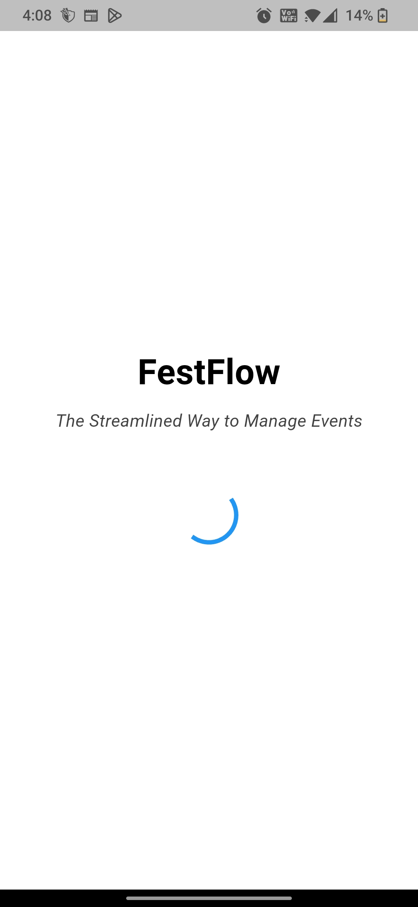</td>
    <td>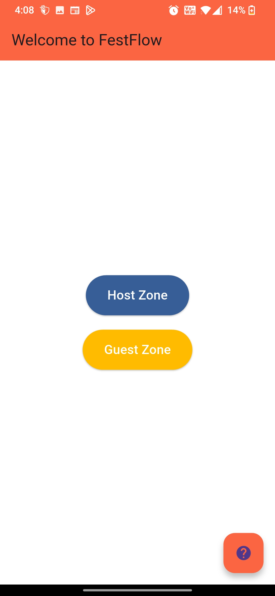</td>
    <td>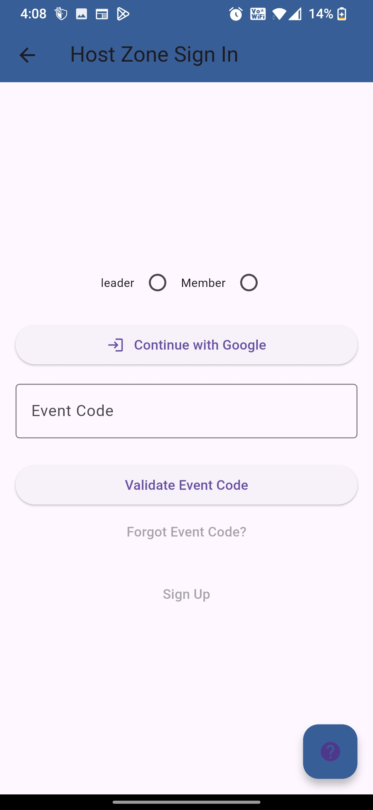</td>
    <td>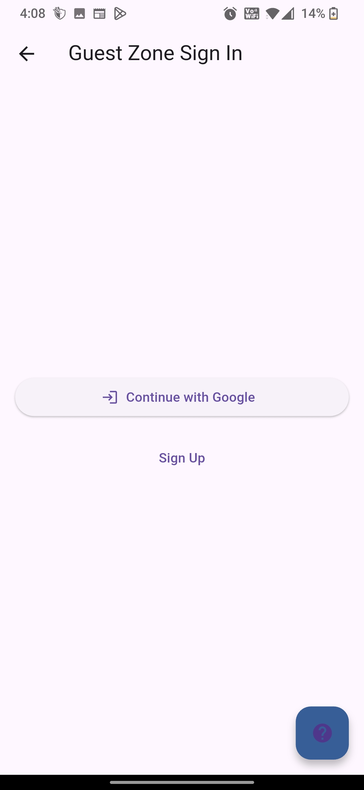</td>
  </tr>
  <tr>
    <td align="center"><i>Dynamic splash with active spinning loader</i></td>
    <td align="center"><i>Role selection gateway</i></td>
    <td align="center"><i>Leaders & staff credentials verification</i></td>
    <td align="center"><i>Quick attendee login & sign up</i></td>
  </tr>
</table>

#### 2. Organizer (Leader) Experience
Leaders enjoy a robust control room with event generation tools, overlay menus, and instant invite codes.
<table width="100%">
  <tr>
    <td width="25%" align="center"><b>Leader Dashboard</b></td>
    <td width="25%" align="center"><b>Quick Menu Overlay</b></td>
    <td width="25%" align="center"><b>Fests Management</b></td>
    <td width="25%" align="center"><b>Dynamic QR Code</b></td>
  </tr>
  <tr>
    <td>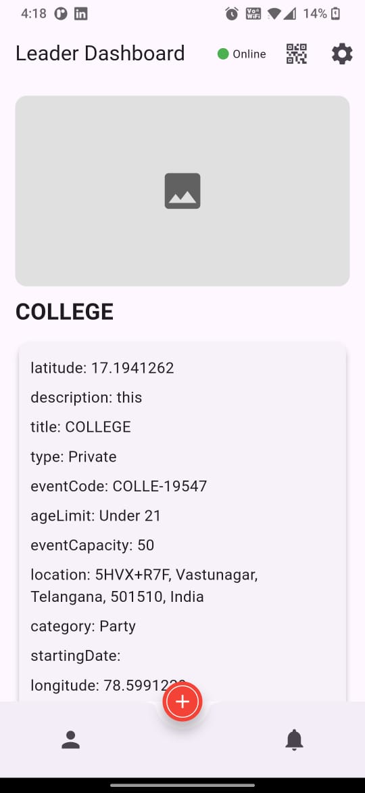</td>
    <td></td>
    <td></td>
    <td>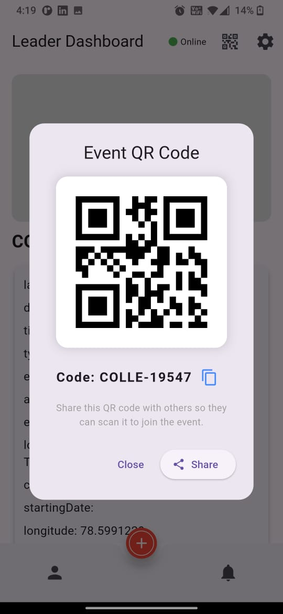</td>
  </tr>
  <tr>
    <td align="center"><i>Primary organizer hub for managing major fests</i></td>
    <td align="center"><i>Glassmorphic bottom-sheet quick action drawer</i></td>
    <td align="center"><i>Browse, filter, and search active fests</i></td>
    <td align="center"><i>Interactive invite code generator and QR scanner dialogue</i></td>
  </tr>
</table>

#### 3. Administrative Operations & Coordination
Coordinate teams, screen incoming guest requests, analyze registration trends, and communicate globally.
<table width="100%">
  <tr>
    <td width="20%" align="center"><b>Guest Screening</b></td>
    <td width="20%" align="center"><b>Staff Management</b></td>
    <td width="20%" align="center"><b>AI Event Analytics</b></td>
    <td width="20%" align="center"><b>Global Live Chat</b></td>
    <td width="20%" align="center"><b>User Profile</b></td>
  </tr>
  <tr>
    <td>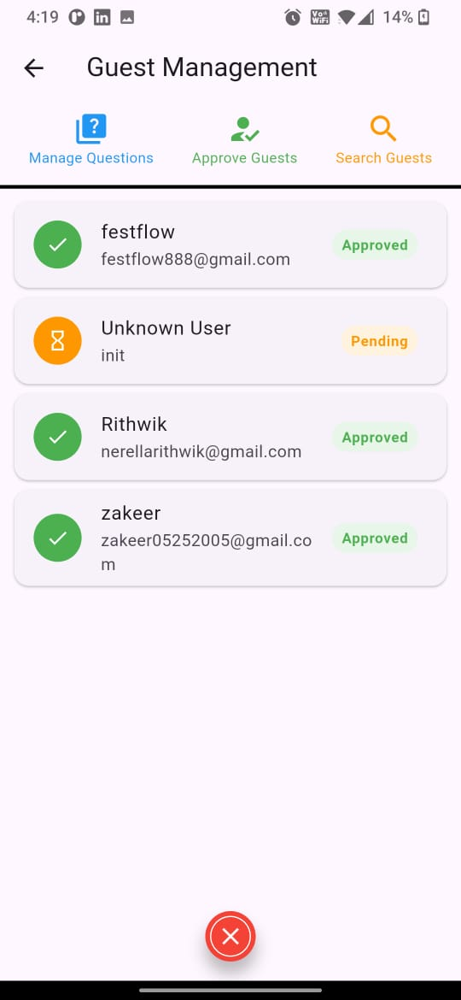</td>
    <td>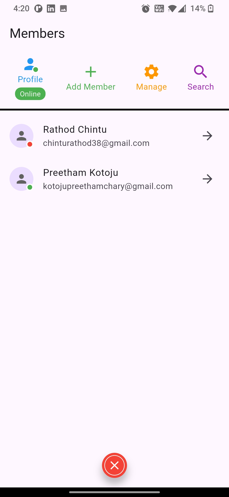</td>
    <td>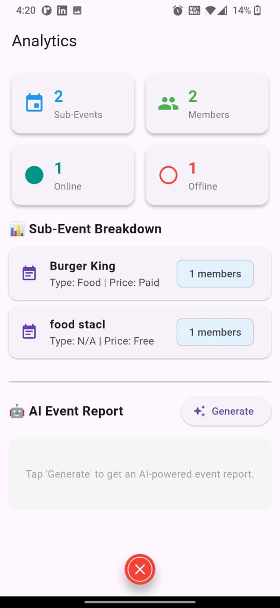</td>
    <td>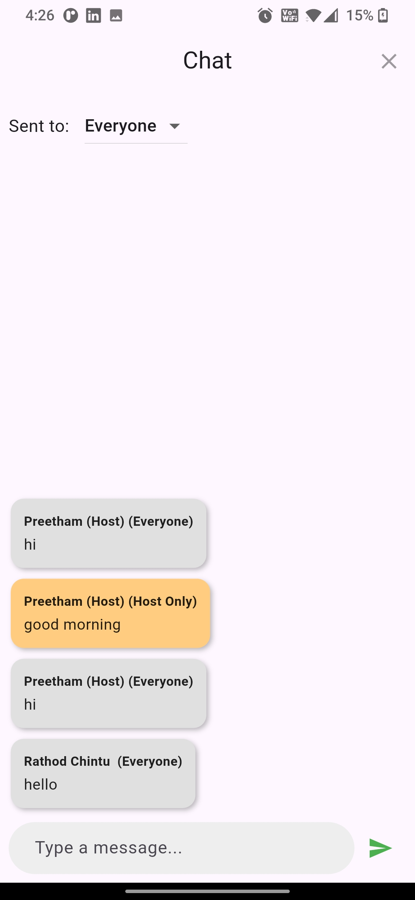</td>
    <td>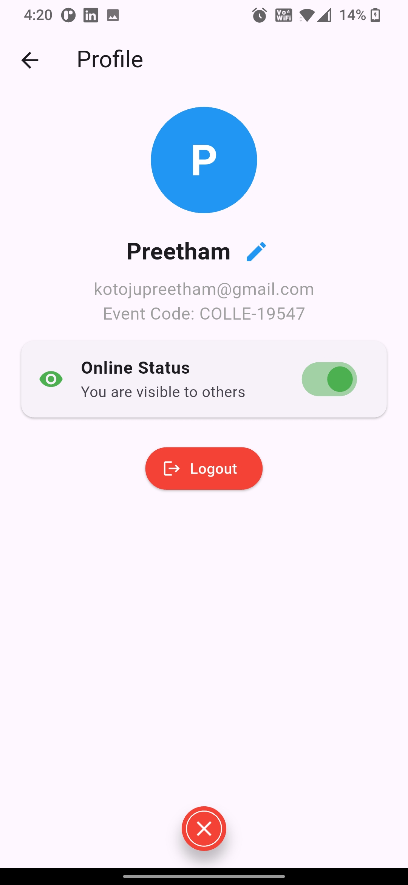</td>
  </tr>
  <tr>
    <td align="center"><i>Real-time guest approval queues</i></td>
    <td align="center"><i>Staff roster listing and real-time presence indicators</i></td>
    <td align="center"><i>Detailed analytics panel with Gemini AI-powered report triggers</i></td>
    <td align="center"><i>Real-time, persistent event-wide chat and announcements</i></td>
    <td align="center"><i>Leader settings and global online status toggle</i></td>
  </tr>
</table>

#### 4. Staff & Guest Onboarding
Coordinators can easily track their assignments while guests register for fests and receive ticket approvals.
<table width="100%">
  <tr>
    <td width="16%" align="center"><b>Staff Home</b></td>
    <td width="16%" align="center"><b>Staff Agenda</b></td>
    <td width="16%" align="center"><b>Guest Home</b></td>
    <td width="16%" align="center"><b>Ticket Approval</b></td>
    <td width="16%" align="center"><b>Sub-Events Hub</b></td>
    <td width="16%" align="center"><b>Assignments Log</b></td>
  </tr>
  <tr>
    <td>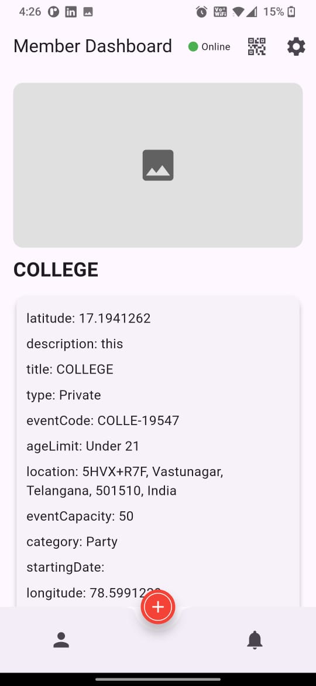</td>
    <td>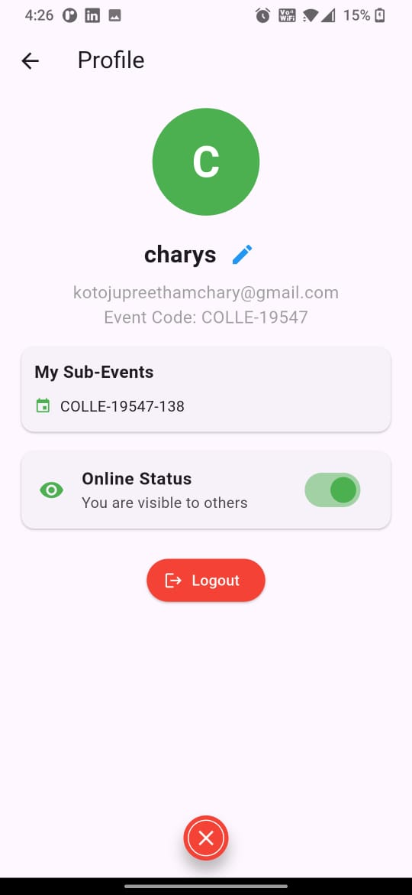</td>
    <td>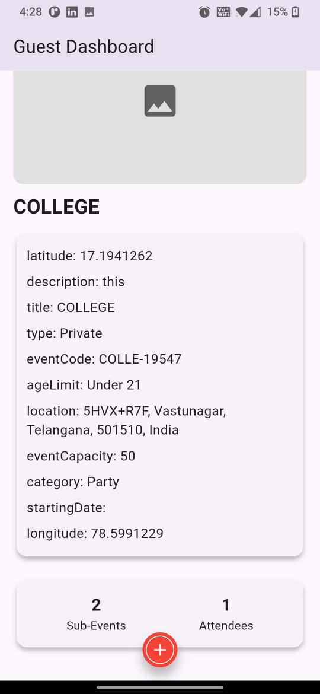</td>
    <td>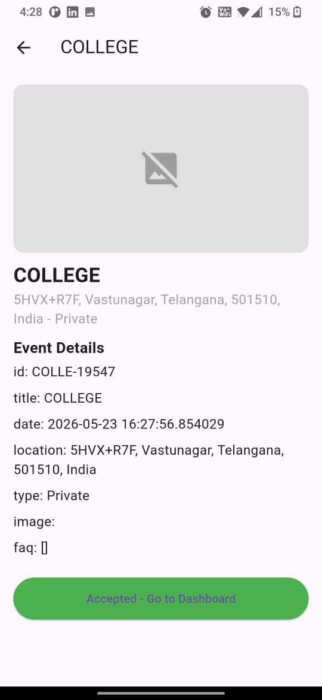</td>
    <td>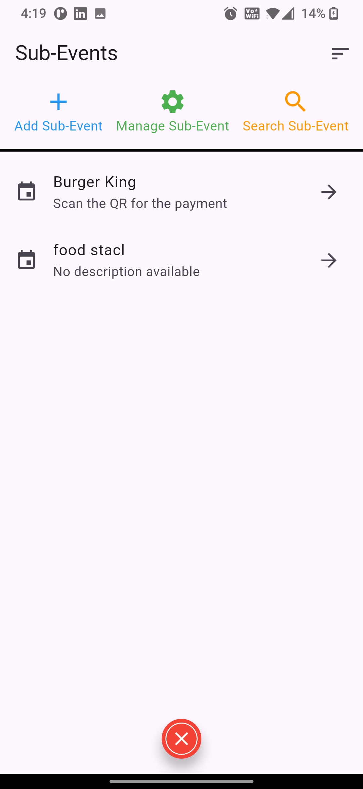</td>
    <td>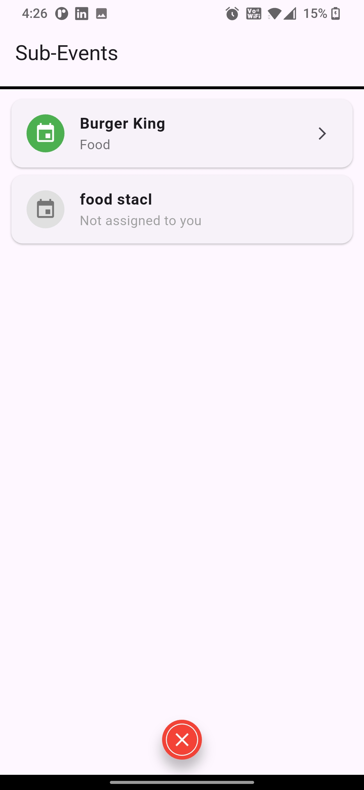</td>
  </tr>
  <tr>
    <td align="center"><i>Coordinator portal for live scanning</i></td>
    <td align="center"><i>Personal agenda check list for coordinators</i></td>
    <td align="center"><i>Attendee hub summarizing event updates</i></td>
    <td align="center"><i>Real-time application screening status dialog</i></td>
    <td align="center"><i>Detailed sub-events list with registration features</i></td>
    <td align="center"><i>Coordinator personal role-assignment checks</i></td>
  </tr>
</table>

---

## 📁 Repository Structure

```
FestFlow/
├── lib/                      # Core Flutter application source
│   ├── admin/                # Admin interfaces
│   ├── guest/                # Guest screens, settings, and workflows
│   ├── home/                 # Launch, auth, services (Gemini, etc.)
│   ├── leader/               # Organizer tools, dashboards, and form creators
│   ├── member/               # Staff check-in tools and stats
│   ├── main.dart             # Application entry point
│   └── global.dart           # Global application state singleton
│
├── assets/                   # Static app resources
│   ├── screenshots/          # App screenshots & UI mockups
│   ├── icons/                # App launchers and icons
│   └── images/               # Image resources & presentation backgrounds
│
├── docs/                     # Documentation
│   ├── architecture/         # System design diagrams (UML Class/Sequence/etc.)
│   └── reports/              # PPTX Presentation Links & documentation reports
│
├── admin_dashboard/          # HTML/JS admin dashboard console
│   ├── index.html            # Dashboard entrance
│   ├── styles.css            # Dark glassmorphic design system
│   └── script.js             # GSAP controller (sanitized)
│
├── web/                      # Flutter Web files
│   └── landing-page/         # Archived original HTML landing pages
│
├── pubspec.yaml              # Dart project manifest
├── LICENSE                   # Proprietary Source-Available License
├── .gitignore                # Hardened security-focused Git excludes
└── README.md                 # Project README (this file)
```

---

## 🚀 Setup & Installation

Please refer to the [Local Setup Guide](docs/SETUP.md) for step-by-step instructions on:
1. Creating your own Firebase project and configuring the Android/iOS client files.
2. Obtaining a Gemini API key and configuring environment variables.
3. Fetching packages and building the application.

---

## 📄 License & Terms

FestFlow is released under the terms of the **FestFlow Source-Available License v1.0**. 

- **Allows**: Source code viewing, local configuration/testing, and educational review.
- **Prohibits**: Commercial usage, re-distribution, and app store publishing.

For complete terms, check the [LICENSE](LICENSE) file.

---

## 📧 Contact & Support

For queries, permissions, or career opportunities:
- **Author**: Kotoju Preetham Chary
- **Email**: kotojupreetham@gmail.com
- **LinkedIn**: [KOTOJU PREETHAM CHARY](https://linkedin.com/in/kotojupreetham) *(Placeholder)*
- **GitHub**: [github.com/kotojupreetham](https://github.com/kotojupreetham)
